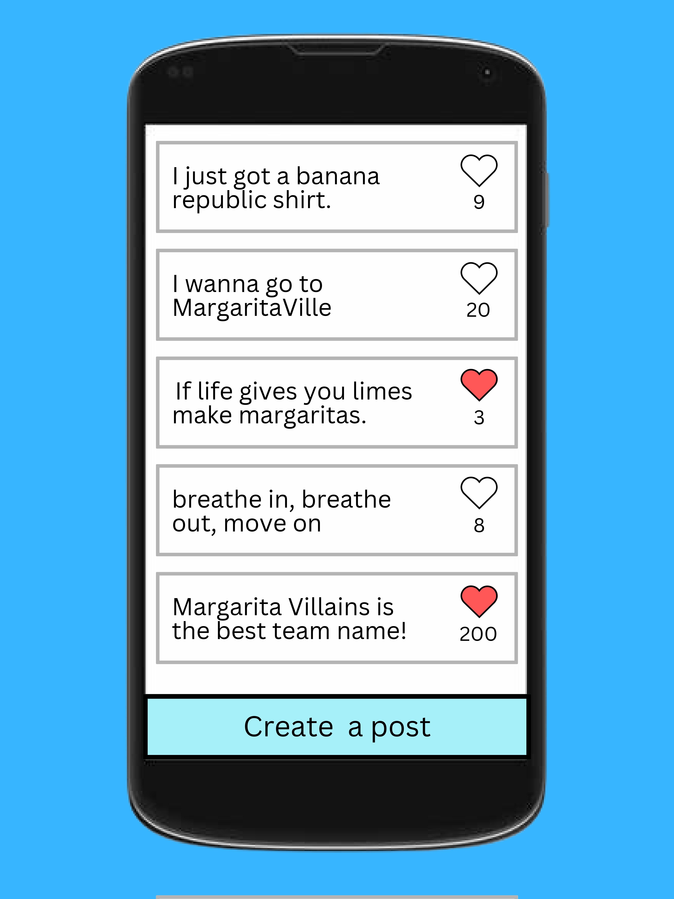

# State Diagram

# Mock Web User Interface

# Mock Mobile Interface

# User Stories/Tests

[Google Docs Link to User Stories/Tests](https://docs.google.com/document/d/1L2m1_GBuI5Bac6Wi-hzB6fgLx3JTylX9qoWlod70r2g/edit?usp=sharing)

# System Drawing with Major Components

# Entity Diagram

# Backend Route Listings
* GET routes
1) .get("/messages/:id", (request, response)) - will return a specific message with its title, body, and likes
2) .get("/messages", (request, response)) - will return all messages with title and likes
* Post routes
1) .post("/messages", (request, response)) - will post new message with title, body, and null likes
* Put routes
1) .put("/messages/:id", (request, response)) - edit the amount of likes on a message
* Delete routes
1) .delete("/messages/:id", (request, response)) - delete a specific messages from the database

# Testing

[Descriptions of the Tests for each Component](https://docs.google.com/document/d/12otxU6lLwTojMmRcqqpRKlj5uO6V8lMntIydhbBi8WM/edit?usp=sharing)
