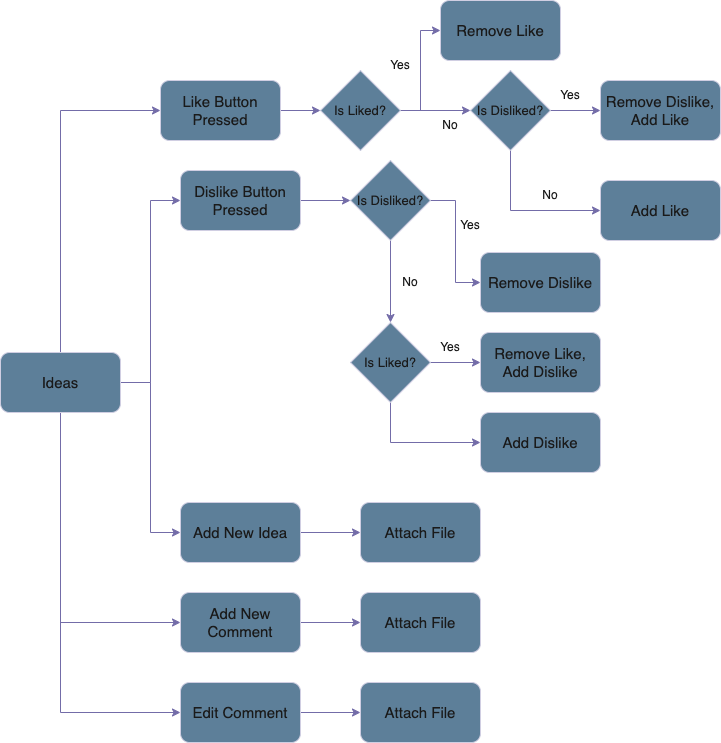
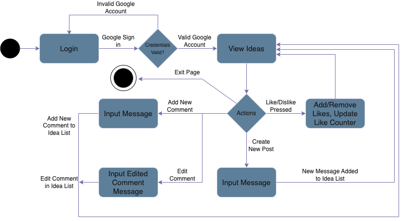
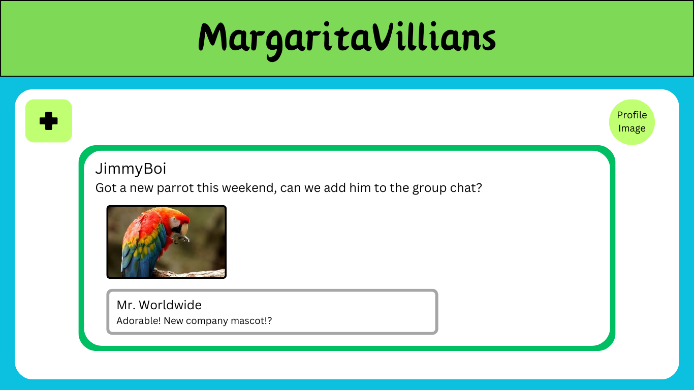

# Routes

* Get routes

   1. .get('/messages/:id/?sessionKey=<insert session key>', (request, response)) - Returns info of specific message. This includes links/files.
   1. .get('/messages?sessionKey=<insert session key>', (request, response)) - Returns array of all messages and information. 
   1. .get('./comments??sessionKey=<insert session key>', (request, response)) - Returns all comments and information
   1. .get('/comments/:mId/?sessionKey=<insert session key>', (request, response)) - Returns array of all comments on specific message post
   1. .get('/comments/:commentId/?sessionKey=<insert session key>', (request, response)) - Returns a comment's id, message, and likes
   1. .get('/users?sessionKey=<insert session key>', (request, response)) - Returns array of all users. 
   1. .get('/users/:id/?sessionKey=<insert session key>', (request, response)) - Returns a specific user's id, name, email,gender identity, sexual orientation, and note
   1. .get('/likes?sessionKey=<insert session key>', (request, response)) - Returns liked messages for specific user

* Post routes

   1. .post('/messages?sessionKey=<insert session key>', (request, response)) - Posts a new message with title and message passed in through the body
   1. .post('/comments?sessionKey=<insert session key>', (request, response)) - Posts a new comment to a message with mId, cContent, uId Passed in
   1. .post('/users?sessionKey=<insert session key>', (request, response)) - Adds a new user to the database. Name, email, GI, SO, and note are passed in through the body

* Put routes

   1. .put('/messages/:id/?sessionKey=<insert session key>', (request, response)) - Edit the number of likes on a message, 0 or 1 passed in depending if the user liked or disliked 
   1. .put('/comments/:commentId/?sessionKey=<insert session key>', (request, response)) - Edit the content of a comment. Pass in cContent in the body. 
   1. .put('/users?sessionKey=<insert session key>', (request, response)) - Edit the details of a user. Name, email, GI, SO, and note are passed in through the body

* Delete routes

   1. .delete('/messages/:id', (request, response)) - Delete a specific message
   1. .delete('/comments/:commentId', (request, response)) - Delete a specific comment
   1. .delete('/users/:id', (request, response)) - Delete a specific user
   
# Backlog

* Admin
   1. OAuth

* Web
   1. OAuth

* Mobile

   1. OAuth
   2. Comments
   3. Dislikes
   4. Profiles

* Backend
   1. OAuth

# User stories and Tests
[User stories](https://docs.google.com/document/d/1bjwfbYccF6UMZZQXPeWqkMymxNFkaRpO4HkUfeKqiH4/edit?usp=sharing)

# System Drawing with major components

# Idea State Machine

# State Machine Drawing

# Web Mock-Up

![page 3]
