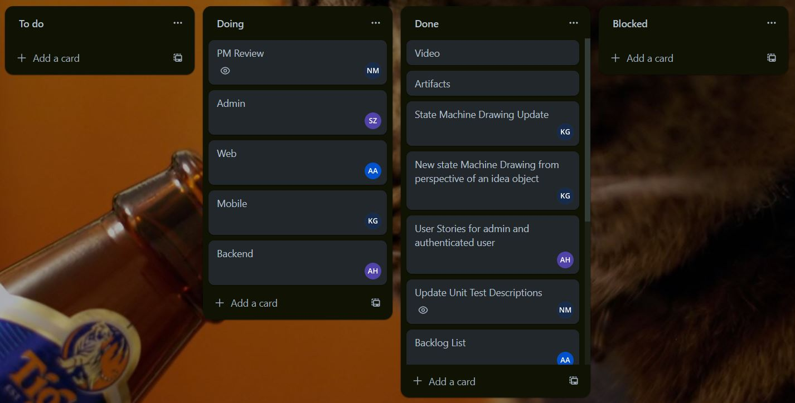

# Phase 3 Sprint 11 - PM Report Template

### Team Information:

* Number: 06
* Name: Margarita Villains
* Mentor: <Ala Chua, anc224@lehigh.edu>
* Weekly live & synchronous meeting:
    * without mentor: 2
    * with mentor:1

### Team Roles:

* Project Manger: <Nicholas Madaio, nmm224@lehigh.edu>
* Backend developer: <Ashly Hirst, ash320@lehigh.edu>
* Admin developer: <Sarah Zwart, scz225@lehigh.edu>
* Web developer: <Aidan Astle, apa225@lehigh.edu>
* Mobile developer: <Kamil Gjondla, kag624@lehigh.edu>

### Essential links for this project:

* Team's Dokku URL(s)
	* [MargaritaVillians Dokku](team-margaritavillians.dokku.cse.lehigh.edu)
* Team's software repo (bitbucket)
	* [Git Repo](https://bitbucket.org/cse216-fa23-kag624/cse216-2023fa-team-6/src/master/)
* Team's Trello board
	* [Trello](https://trello.com/b/BoSzjoaH/phase-3)

Screenshot of Trello board:

## General questions [15 points total]

1. Did the PM for this week submit this report (If not, why not?)? 
The PM submitted the report.
2. Has the team been gathering for a weekly, in-person meeting(s)? If not, why not?
	Yes, after class and whenever necessary.
3. Summarize how well the team met the requirements of this sprint.
    * Comment both on the app design as a whole, as well as on the design and implementation of individual components.
        * For example, how well did each member balance and make best use of their time across their individual work, as tutorial and group-work (including class time, if relevant).

	We met many of the requirements of the sprint by following the rubric’s guidelines and reviewing code together. This sprint in particular caused confusion among everyone. Many moving parts are coming together, so the code review has been volatile with changes. Aiden took on the Web frontend, and was able to implement links, not necessarily hyperlinks though. Next He showed file uploading, but couldn’t show it running in Dokku due to a server error. Kamil worked on Mobile this time, and had several issues to work through due to an unfamiliarity we all share with dart files. He was able to work on parts of all the requirements, but got furthest on caching. Links and files are furthest from completion. Sarah took on admin, and was able to get most everything done in a timely manner and demonstrate it working. Finally, Ashley worked on the Backend branch and was able to get caching with Memcachier to work, and added in links and files as works in progress. As stated before, code reviews are volatile, mobile code is especially messy but that’s we can’t place the blame on anyone for that. Work balance was difficult to gauge, since it's the second to last week of school, we all have projects and othe things we need to get done along with our sprints. All things considered, we managed our time as best we could

4. Report on each member's progress (sprint and phase activity completion) – "what is the status?"
Aiden and Sarah were able to achieve most of their goals, however I feel this is in part due to the goals of Ashley being greater in number. Kamil has a lot to do in the prime phase, which I wouldn’t say is his own fault since every sprint we all have to pick up new skills, and it happens that Mobile is the most unfamiliar for all of us. All tasks will be completed by the end of the prime phase, what has been done so far is satisfactory. 

5. Summary of "code review" during which each team member discussed and showed their progress – "how did you confirm the status?"
I was able to see all the code in action during our three in person meetings throughout the week. All of this was done as a team, so code reviews involved us all-together. Thus, everything was scheduled. I did try to keep an updated checklist on Trello but that doesn’t show how close each member is to completing a task.

6. What did you do to encourage the team to be working on phase activities "sooner rather than later"?
	There is only so much I can do to encourage everyone to work on code sooner rather than later. I sent reminders via sms, but I can’t help it if its the last week of school and other projects are due. All that was within my power was to make the suggestion.

7. What did you do to encourage the team to help one another?
	We were already helping each other get our work done, there was no need to encourage each other to do this. We were open and honest about where we were all at in the project, no problems arose in this regard.
8. How well is the team communicating?
Nothing has changed in our communication from the previous sprint. The team is communicating well; we are able to focus on our tasks while still being friendly. We communicate frequently and clearly, and work efficiently as expected. 

9. Discuss expectations the team has set for one another, if any. Please highlight any changes from last week.
There were no changes from last week. The expectations we have set for each other is that we all communicate frequently within reason, and that we make a fair attempt to complete all tasks even if we aren’t able to complete them. We meet often, if anyone has a prior arrangement and can’t make the meeting it is always dictated to the rest of the team. We always share and show our work, as is expected.

10. If anything was especially challenging or unclear, please make sure this is [1] itemized, [2] briefly described, [3] its status reported (resolved or unresolved), and [4] includes critical steps taken to find resolution.

The most challenging aspects of our project came in developing goals for the mobile branch.
*Challenge: Achieving goals in the mobile branch
 * Description: Issues arose in getting links and files to show up in the mobile branch. This was a problem that mostly involved mobile and backend. 
 * Status: unresolved 
 * Critical Steps: We are still unresolved, but the first step was to fix up our mobile and do an all hands on deck during the prime phase to move on from our lack of understanding.. The issue will be resolved soon.

11. What might you suggest the team or the next PM "start", "stop", or "continue" doing in the next sprint?
There won’t be another PM. However, a next PM should do more research into dart files such that what must be done in the web branch can transfer over to the mobile branch. 

## Role reporting [75 points total, 15 points each (teams of 4 get 15 free points)]
Report-out on each role, from the PM perspective.
You may seek input where appropriate, but this is primarily a PM related activity.

### Back-end

1. Overall evaluation of back-end development (how was the process? was Trello used appropriately? how were tasks created? how was completion of tasks verified?)
	Back-end development went as well as it could have gone. All we can ask of each other is to learn along the way and come back with something to present. Trello was used appropriately, tasks were created using the rubric, and verified at our meeting when we discussed our progress.
2. List your back-end's REST API endpoints
* get(“/messages”) //Gets all messages
* get(“/messages/<insert message id>”) //Gets a specific message
* post(“/messages”) //Adds a new message 
* put(“/messages/<insert message id>”) //Likes or dislikes depending on what’s passed into the body
* delete(“/messages/<insert message id>”) //Delete a specific message
* get(“/comments/<insert message id>”) //Gets all comments from a specified message
* get(“/comments”) //Gets all comments from all messages
* put(“/comments/<insert comment id>”) //Edits a comment
* post(“/comments”) //Adds a new comment to a specific post
3. Assess the quality of the back-end code
	Back-end, is in need of refactoring, but is overall within expectation.
4. Describe the code review process you employed for the back-end
	We all met together to discuss code, Ashly discussed the problems she was having along with her successes.
5. What was the biggest issue that came up in code review of the back-end server?
	Biggest issue is not all the goals being achieved, however we have a plan to meet those in the prime phase.
6. Is the back-end code appropriately organized into files / classes / packages?
	The code is organized into separate files.
7. Are the dependencies in the `pom.xml` file appropriate? Were there any unexpected dependencies added to the program?
	No unexpected dependencies added.
8. Evaluate the quality of the unit tests for the back-end
	The unit test for backend involved manually entering curls, which takes some time, but it’s the only way we have right now.
9. Describe any technical debt you see in the back-end
	The technical debt for this back-end is to finish the goals given for this sprint in the prime phase.

### Admin

1. Overall evaluation of admin app development (how was the process? was Trello used appropriately? how were tasks created? how was completion of tasks verified?)
	Admin development smoothly from start to finish. Trello was used to manage progress, tasks were created using the rubric, and verified at our meeting when we discussed our progress.
2. Describe the tables created by the admin app
	Two new tables for files and links were created, other tables are for ideas, likes, users, and comments.
3. Assess the quality of the admin code
	The admin code is well put together.
4. Describe the code review process you employed for the admin app
	Code review process was done together during the meetings over the week, fortunately things worked out well when it came time to implement.
5. What was the biggest issue that came up in code review of the admin app?
	The only issue mentioned was coordinating with the backend such that the tables match.
6. Is the admin app code appropriately organized into files / classes / packages?
	The code is appropriately organized into files.
7. Are the dependencies in the `pom.xml` file appropriate? Were there any unexpected dependencies added to the program?
	All dependencies are appropriate, nothing unexpected.
8. Evaluate the quality of the unit tests for the admin app
	The unit test for admin is an organized file of functions kept in a separate folder.
9. Describe any technical debt you see in the admin app
	Admin technical debt mostly involves refactoring with the backend and possibly merging some functions together.

### Web

1. Overall evaluation of Web development (how was the process? was Trello used appropriately? how were tasks created? how was completion of tasks verified?)
	Web development was rather bumpy. A lot of code was written that needs to be touched up before I can say that we reached all our goals for this branch. Trello was used to manage progress, tasks were created using the rubric, and verified at our meeting when we discussed our progress.
2. Describe the different models and other templates used to provide the web front-end's user interface
	The model, although not shown in the video, was shown during code review to have code to be refactored for the future. The UI uses cards, and menus that lead to other pages, more pages will be operational by the prime phase. The front end is still in react, which is what more members know how to use.
3. Assess the quality of the Web front-end code
	The new code is still in need of a clean up, however things from the previous sprint are still organized.
4. Describe the code review process you employed for the Web front-end
	Code review process was done together during the meetings over the week.
5. What was the biggest issue that came up in code review of the Web front-end?
	In the web front end, an issue arose with Dokku that prevented the web front end’s UI from being shown.
6. Is the Web front-end code appropriately organized into files / classes / packages?
	Web front end is organized into both files and folders.
7. Are the dependencies in the `'ackage.json' file appropriate? Were there any unexpected dependencies added to the program?
	All dependencies are appropriate, nothing unexpected.
8. Evaluate the quality of the unit tests for the Web front-end
	The web test manually checks the functions implemented. It tells us directly if the feature works as expected.
9. Describe any technical debt you see in the Web front-end
	Debt involves cleaning code and better implementing the features of the goal.

### Mobile

1. Overall evaluation of Mobile development (how was the process? was Trello used 
appropriately? how were tasks created? how was completion of tasks verified?)
	Web development was the rockiest. We need to work through some issues to get all of the goals met. Trello was used to manage progress, tasks were created using the rubric, and verified at our meeting when we discussed our progress.
2. Describe the activities that comprise the Mobile app
Mobile app can add, like, and delete posts. We are working on a solution to add links and files.
3. Assess the quality of the Mobile code
	New Mobile code needs to be refactored, it needs to be easier to understand so someone could pick up mobile in the future - even though this is the last phase.
4. Describe the code review process you employed for the Mobile front-end
	Code review process was done together during the meetings over the week.
5. What was the biggest issue that came up in code review of the Mobile front-end?
	Biggest issue in code reviews has been trying to put the code together in time before the code reviews.
6. Is the Mobile front-end code appropriately organized into files / classes / packages?
	The Mobile front-end is appropriately organized into files and folders.
7. Are the dependencies in the 'pubspec.yaml' (or build.gradle) file appropriate? Were there any unexpected dependencies added to the program?
	All dependencies are appropriate, nothing unexpected.
8. Evaluate the quality of the unit tests for the Mobile front-end here
	The mobile test manually checks the functions implemented. It tells us directly if the feature works as expected.
9. Describe any technical debt you see in the Mobile front-end here

### Project Management
Self-evaluation of PM performance

1. When did your team meet with your mentor, and for how long?
	We met with our mentor on Thursday for 45 minutes.
2. Describe your use of Trello.  Did you have too much detail?  Too little?  Just enough? Did you implement policies around its use (if so, what were they?)?
	I did include more detail, however I removed it due to its lack of usefulness. 
3. How did you conduct team meetings?  How did your team interact outside of these meetings?
	We interacted in a friendly manner in our meetings, similarly to how we act outside our meetings.
4. What techniques (daily check-ins/scrums, team programming, timelines, Trello use, group design exercises) did you use to mitigate risk? Highlight any changes from last week.
	I used trello to keep track of what got done, Slack and SMS were used for communications. No changes from last week.
5. Describe any difficulties you faced in managing the interactions among your teammates. Were there any team issues that arose? If not, what do you believe is keeping things so constructive?
	Interactions haven't been difficult, no issues in communication arose.
6. Describe the most significant obstacle or difficulty your team faced.
	Most significant obstacle this week was other projects and high workload in other classes.
7. What is your biggest concern as you think ahead to the next phase of the project? To the next sprint?
	My concern for the next sprint is that we will all be busy finishing up our other final projects.
8. How well did you estimate time during the early part of the phase?  How did your time estimates change as the phase progressed?
	Although it could have been better, there's only so much time we can commit to each and every project.
9. What aspects of the project would cause concern for your customer right now, if any?
	Likely that the UI's are in need of a fix.
